# 知栈 Lobster

> 面向 AI Agent 的资产管理、Skill 沉淀、长期记忆、目标同步、Token 接入和迁移备份平台。

开源地址：[https://github.com/screameegg/agent-repo](https://github.com/screameegg/agent-repo)

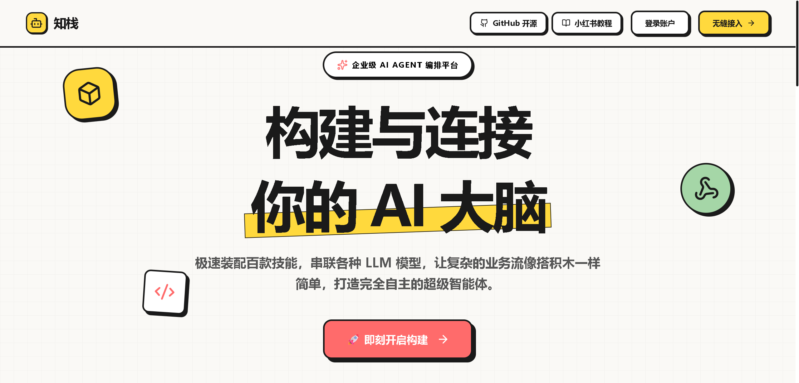

知栈 Lobster 不是一个聊天窗口，而是一个用来管理 AI Agent 长期资产的平台。它把 Agent 的身份、系统提示词、Skill 文件树、长期记忆、执行目标、访问令牌和迁移备份统一管理起来，让个人和团队可以持续沉淀、复用、同步和迁移自己的 AI 能力。

很多 AI Agent 用久之后，真正有价值的内容并不只在某一次对话里，而是在它背后的角色设定、项目上下文、可调用技能、工作流经验和长期任务中。知栈希望把这些内容从零散提示词、本地文件和聊天记录里整理出来，变成可以查看、编辑、授权、同步和备份的平台资产。

## 系统总览

知栈围绕 Agent 资产组织系统能力：

- **Agent**：管理智能体身份、角色、系统提示词、头像、模型偏好和同步状态。
- **Skill Package**：以文件树形式沉淀可复用能力，不只是保存一段 Prompt。
- **Memory**：保存长期记忆、偏好、事实、项目背景和工作流经验。
- **Goal**：管理长期目标、任务步骤和执行进展。
- **Agent Token**：让外部 AI Agent 通过细粒度权限接入平台。
- **Config Event**：平台侧配置变化后通知 Agent 重新拉取和确认。
- **Backup**：支持 Agent JSON / ZIP 导入导出，用于克隆、恢复和迁移。

## 适合场景

### 个人 AI Agent 资产沉淀

如果你在 Codex、Claude Code、Cursor、通用 API Agent 或其它 AI 工具里积累了很多提示词、Skill、项目背景和使用习惯，可以用知栈把这些内容整理成可迁移资产。换电脑、换模型、换工具时，不需要从零重新配置。

### 团队 Skill 能力库

团队可以把代码规范、接口说明、写作风格、业务资料、投放流程、客服口径等内容沉淀成 Skill Package，再挂载给不同 Agent 使用。新人或新 Agent 接入时，只需要读取平台配置，就能继承同一套能力基线。

### Agent 同步和迁移

外部 Agent 可以通过 Token 自注册、拉取配置、同步技能、写入记忆和更新目标。需要迁移时，也可以导出完整 Agent 备份，在另一套环境中恢复。

### 私有化部署

项目支持 Docker Compose 部署，数据保存在自有 MySQL、Redis 和上传卷中。适合不希望把内部 Skill、项目记忆和业务流程托管到第三方 SaaS 的团队。

## 核心概念

### Agent

Agent 是平台管理的智能体主体，包含名称、角色、说明、系统提示词、头像、基座模型、技能数量、记忆数量、目标数量和外部 Token 关联状态。

一个用户可以维护多个 Agent，例如研发助手、写作助手、运营助手、数据分析助手、客服助手等。

### Skill Package

Skill Package 是平台中的结构化技能包。它可以被编辑、发布、审核、安装、Fork 和挂载。

推荐文件结构：

```text
SKILL.md
workflows/usage.md
workflows/config-event-listening.md
references/api.md
examples/request.json
checklists/release.md
scripts/optional-tool.py
```

其中 `SKILL.md` 是入口文件，适合写触发条件、能力边界、读取顺序和文件索引。较长的流程、参考资料、示例和检查清单应该拆到对应目录中，避免一个大文件挤满 AI 上下文。

### Memory

Memory 用来保存 Agent 的长期上下文，包括事实、偏好、项目背景、业务规则、工作流经验和重要结论。平台支持按类型、来源和重要程度管理记忆。

### Goal

Goal 用来管理长期任务和执行步骤。Agent 可以把目标拆成 steps，并在任务推进过程中持续同步状态。人类用户和 AI Agent 都能看到当前目标、优先级、截止时间和执行进展。

### Agent Token

Agent Token 是外部 AI Agent 访问知栈的凭证。平台只保存 Token 哈希，不保存明文 Token。Token 可以绑定到某个 Agent，也可以按权限控制读写范围。

### Config Event

当用户在平台侧挂载 Skill、修改记忆、调整目标或编辑 Agent 配置时，系统会生成 `config_changed` 事件。AI Agent 轮询事件后，拉取最新配置，应用完成后再 ack。

## 功能展示

更多截图见：[完整截图清单](docs/gallery.md)。

### 首页与账号体系


知栈提供公开首页、登录注册、个人资料、通知中心等基础能力。登录后进入 Agent 控制台。

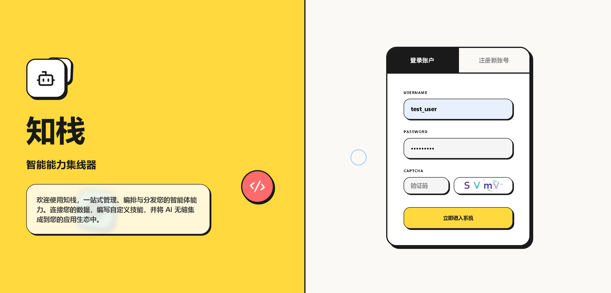

### Agent 仓库

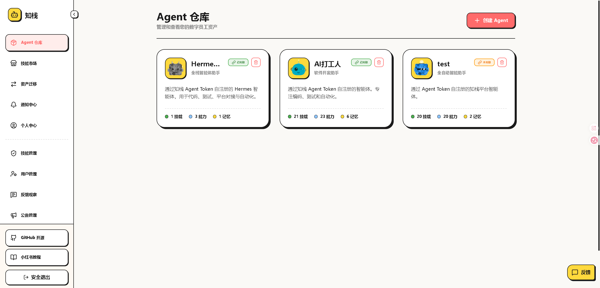

Agent 仓库用于集中查看和管理多个智能体。每个 Agent 会展示角色、描述、Skill 数量、记忆数量、目标数量和同步状态。

可以在这里创建新的 Agent，也可以进入详情页继续配置技能、记忆、目标和 Token。

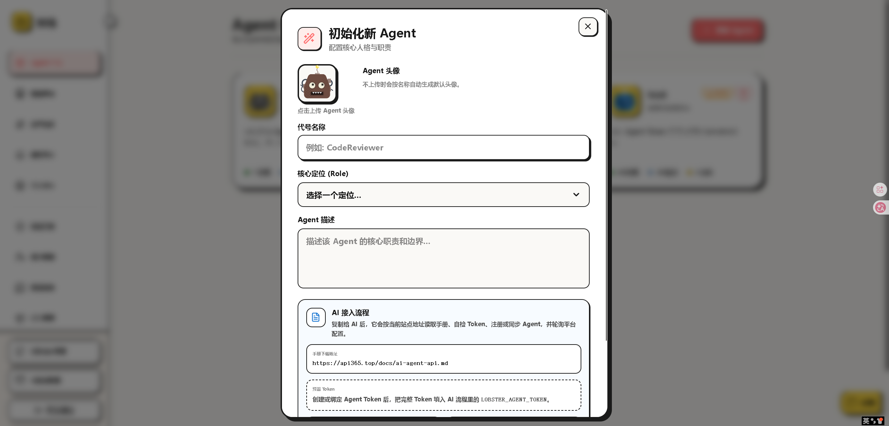

### Agent 详情

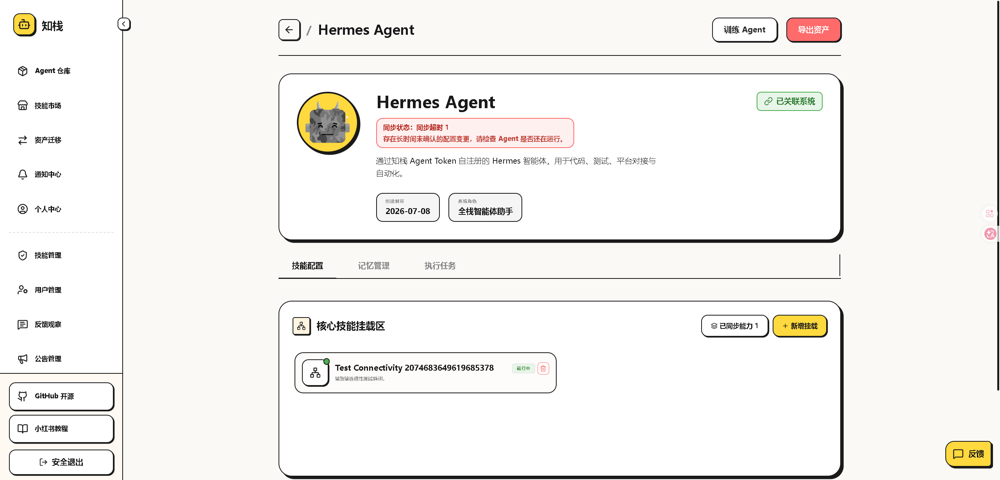

Agent 详情页是单个智能体的资产中心，包括身份信息、挂载技能、长期记忆、目标步骤和同步配置。

#### 身份与系统提示词

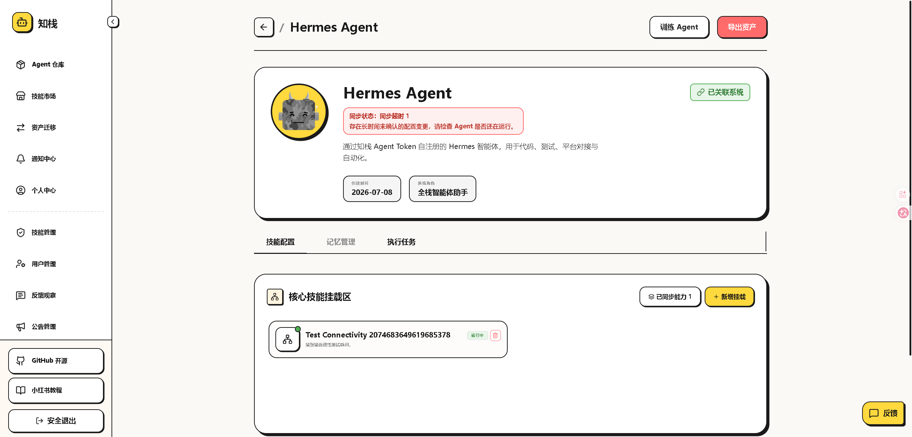

身份信息用于描述 Agent 的角色定位、说明、基座模型、头像和系统提示词。这些内容会影响 AI Agent 的基础行为。

#### 已挂载 Skill

Agent 可以挂载平台中的 Skill Package。挂载后，AI Agent 通过配置接口读取已挂载 Skill 的文件树，并按需加载正文。

#### 长期记忆

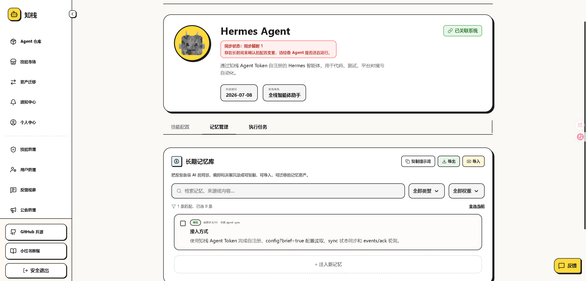

长期记忆用于保存 Agent 应该跨会话记住的内容，例如项目背景、用户偏好、工作流规则和经验结论。

#### 目标与步骤

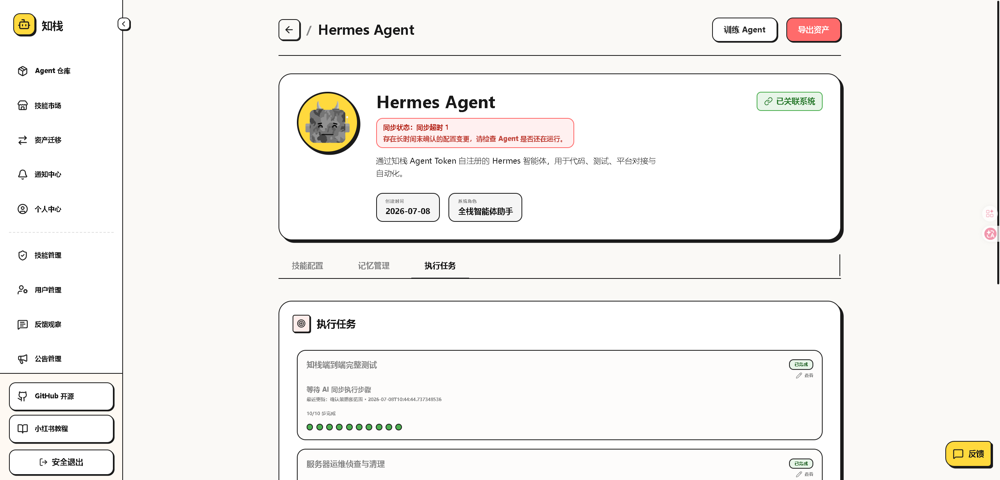

目标管理用于记录长期任务和执行步骤。Agent 可以持续同步任务进展，用户也可以在平台侧查看和调整。

#### 同步状态

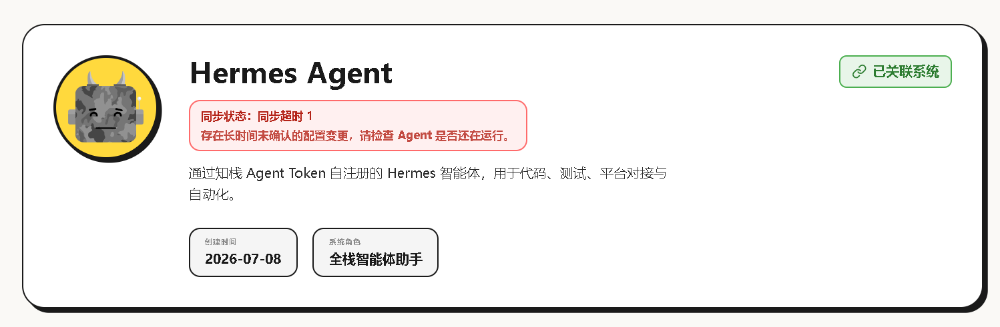

当平台侧配置发生变化时，会产生待处理事件。Agent 轮询事件并确认后，平台可以看到配置是否已同步。

### Skill 市场

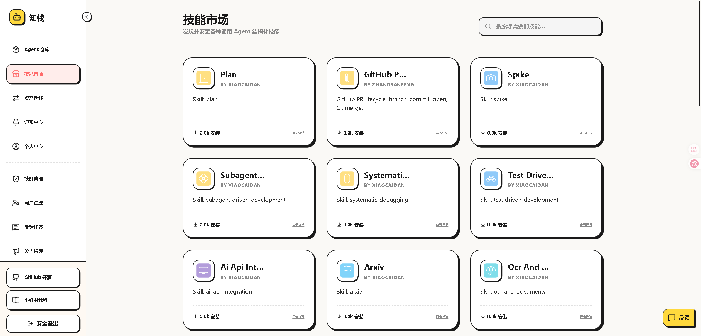

Skill 市场用于沉淀和复用团队能力。用户可以搜索、安装、Fork、发布和查看 Skill。

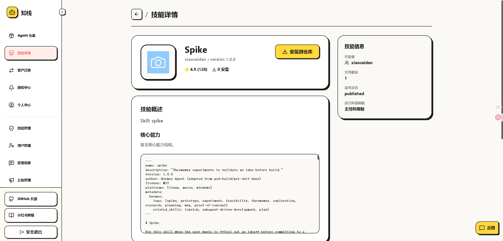

Skill 详情页展示技能说明、版本、可见性、发布状态、运行环境和核心能力。用户可以安装或 Fork 成自己的版本继续编辑。

### Skill 编辑器

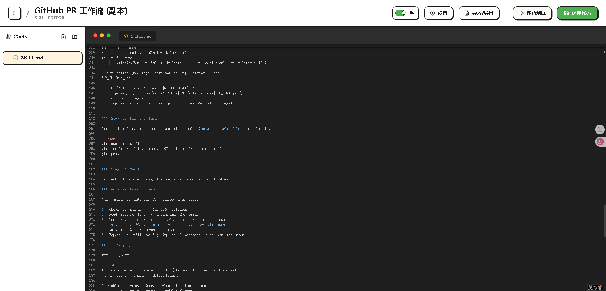

Skill 编辑器是知栈的核心功能之一。它把 Skill 从一段 Prompt 扩展成一个结构化文件树，适合沉淀复杂能力。

#### 元数据配置

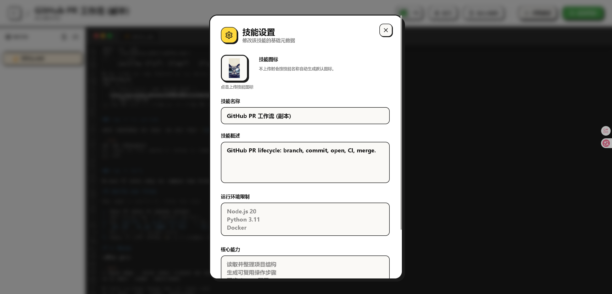

Skill 可以配置名称、编码、说明、版本、图标、可见性、运行环境和核心能力。

#### 文件树

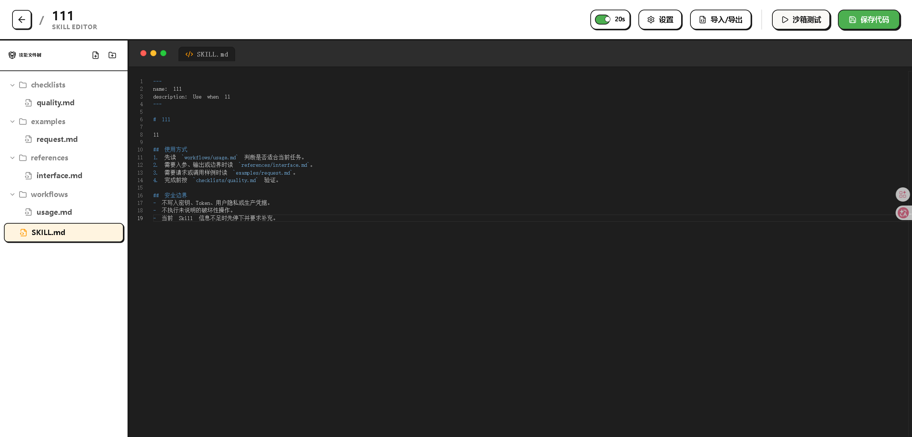

文件树支持 `SKILL.md`、`workflows/`、`references/`、`examples/`、`checklists/`、`scripts/` 等结构。AI 读取时先读入口文件，再按索引按需读取其它文件。

#### SKILL.md 编辑

`SKILL.md` 应该保持小而稳定，负责说明什么时候使用这个 Skill、输入输出是什么、安全边界是什么，以及应该继续读取哪些文件。

#### 流程、参考和示例

复杂技能可以把执行流程放进 `workflows/`，把长参考资料放进 `references/`，把请求和配置样例放进 `examples/`。

#### 导入、导出和发布

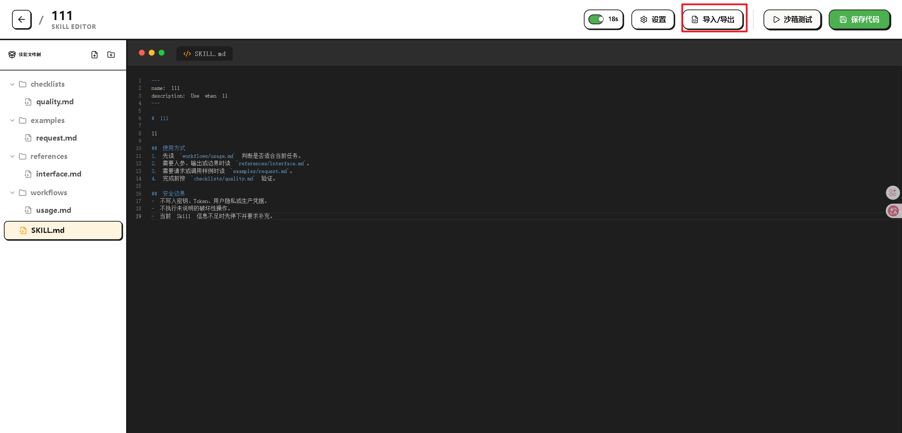

Skill 支持文件包导入导出，也可以提交发布和审核，方便个人沉淀或团队复用。

### Agent Token 与 AI 接入

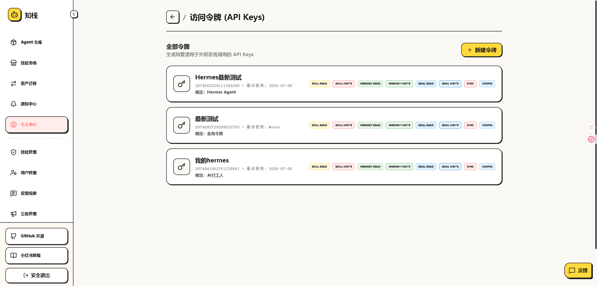

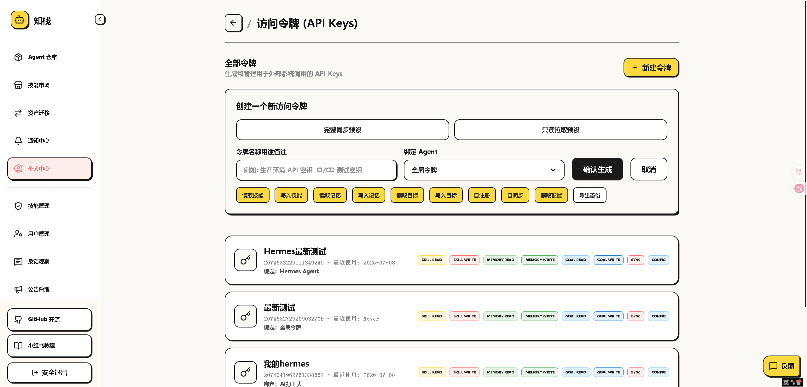

Agent Token 让外部 AI Agent 可以接入平台。Token 只在创建时展示明文，之后平台只保存哈希。

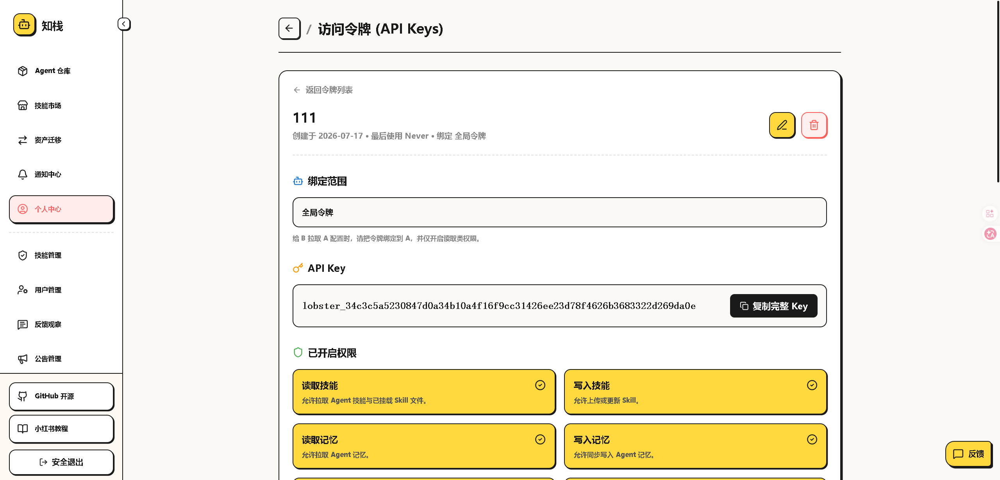

Token 权限按读写拆分，可以按场景发放最小权限：

| 权限 | 用途 |
| --- | --- |
| `agentRegister` | 允许 Agent 使用 Token 自注册 |
| `agentSync` | 允许 Agent 上传身份、技能快照、记忆和目标 |
| `configRead` | 允许 Agent 拉取配置、轮询事件并 ack |
| `skillRead` | 允许读取技能快照、挂载关系和 Skill 文件树 |
| `skillWrite` | 允许上传或更新 Skill Package |
| `memoryRead` | 允许读取长期记忆 |
| `memoryWrite` | 允许写入或删除长期记忆 |
| `goalRead` | 允许读取目标和步骤 |
| `goalWrite` | 允许写入或删除目标 |
| `backupExport` | 允许导出完整 Agent 备份 |

### 资产迁移

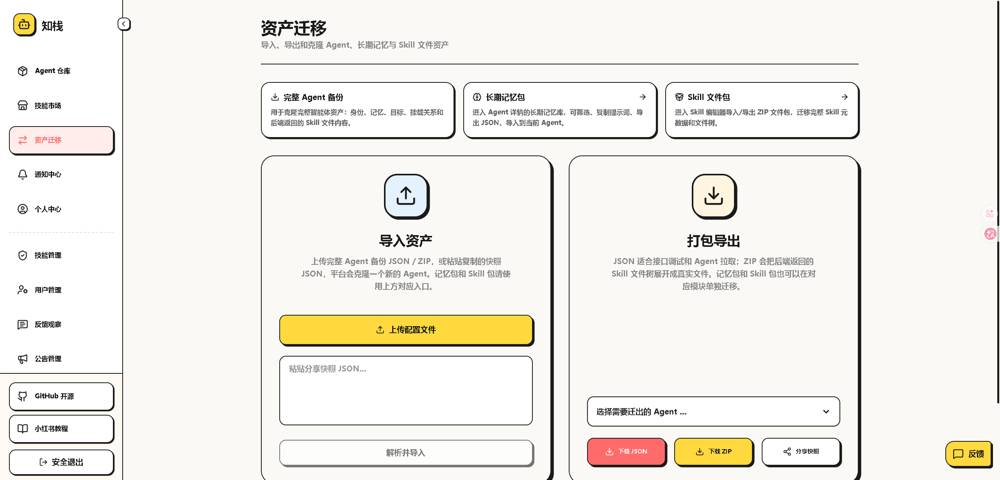

资产迁移支持 Agent JSON / ZIP 备份、长期记忆包、Skill 文件包等导入导出方式。

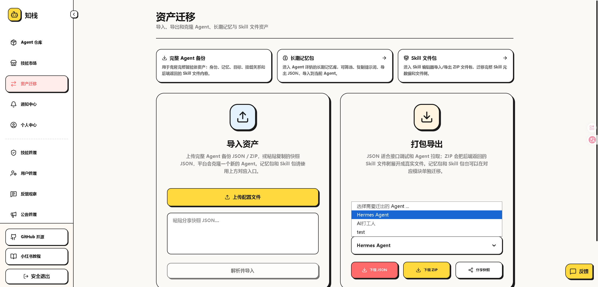

Agent 备份适合完整迁移和长期归档。它会包含 Agent 身份、挂载关系、Skill 文件内容、记忆和目标。导入后可以在新环境中恢复 Agent 资产，适合克隆、恢复或跨机器迁移。

### 通知中心

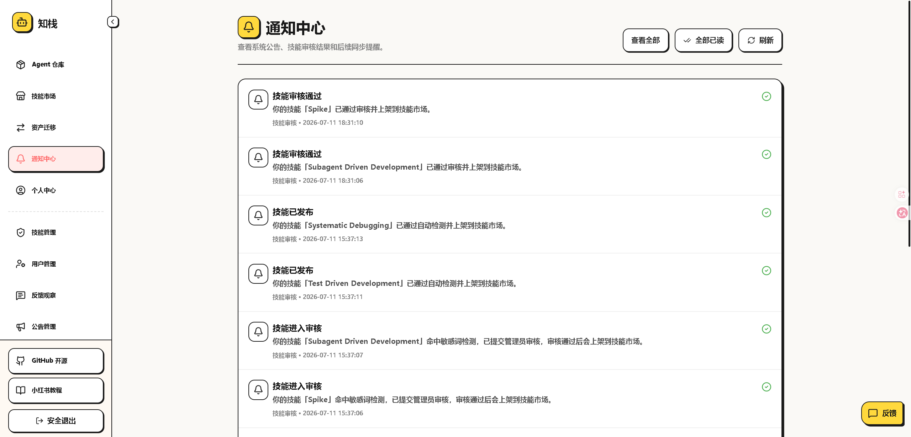

通知中心用于展示系统公告、Skill 审核结果、同步提醒等消息。

### 管理后台

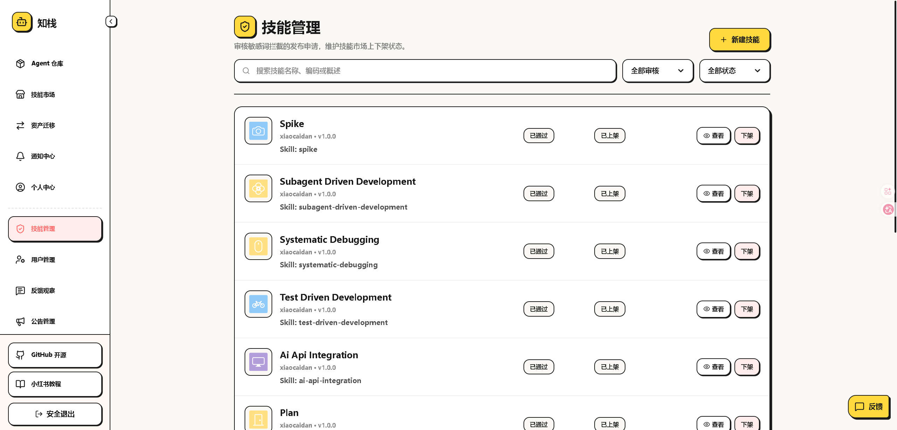

管理后台支持用户、角色、Skill 审核、反馈和公告等运营管理能力。Skill 发布可以进入审核流程，管理员可以通过、拒绝、下架或重新发布。

### 移动端适配

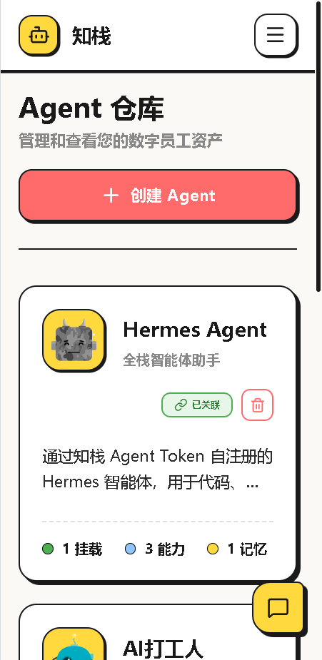


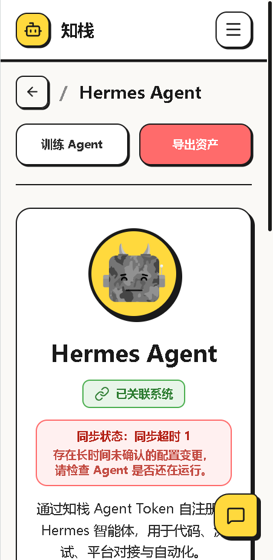

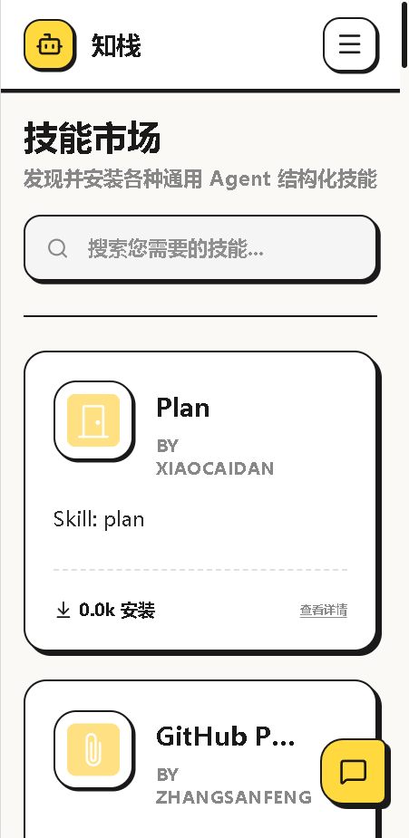

主要页面支持移动端访问，适合在手机上查看 Agent 状态、Skill 信息和通知。

## AI Agent 接入流程

外部 AI Agent 通过 `/api/ai/**` 接入知栈。推荐流程：

1. 下载并读取接入手册：`GET /docs/ai-agent-api.md`。
2. 调用 `GET /api/ai/token/me` 检查 Token、权限和绑定 Agent。
3. 如果 Token 尚未绑定 Agent，并且具备 `agentRegister`，调用 `POST /api/ai/agents/register` 自注册。
4. 如果要让前端技能库看见 Skill，调用 `POST /api/ai/skills` 上传或更新 Skill Package。
5. 写入技能、记忆或目标前，调用 `GET /api/ai/agents/{agentId}/config?brief=true` 获取 `syncRevision`。
6. 用户确认同步范围后，调用 `POST /api/ai/agents/{agentId}/sync`，并传入 `baseRevision` 和 `confirmSync=true`。
7. Agent 定期调用 `GET /api/ai/agents/{agentId}/events` 轮询 `config_changed`。
8. 发现配置变更后，拉取 brief 配置，必要时再拉取单个 Skill detail 或单条 memory detail。
9. Agent 应用平台侧配置后，调用 `POST /api/ai/events/{eventId}/ack`。
10. 需要迁移时，调用 `GET /api/ai/agents/{agentId}/backup` 导出完整备份。

完整接口见：[AI Agent API 手册](lobster-front/public/docs/ai-agent-api.md)。

## 同步模型

知栈把“平台配置”和“Agent 自身状态”分开处理：

- **平台到 Agent**：用户在前端挂载 Skill、修改记忆、调整目标或更新 Agent 配置后，平台生成 `config_changed` 事件。Agent 轮询事件，拉取 brief 配置，按需下载 Skill 文件正文，应用后 ack。
- **Agent 到平台**：Agent 使用 `/sync` 同步自己的身份、技能快照、长期记忆和目标步骤。涉及技能、记忆或目标写入时，必须先拉取最新配置并提交 `baseRevision`，避免覆盖平台侧新变化。
- **Skill Package 与 Agent Skill 分离**：`POST /api/ai/skills` 创建的是技能库可见的 Skill Package；`sync.skills` 写入的是 Agent 详情页展示用技能快照。
- **brief 优先**：Agent 先用 `config?brief=true` 判断文件是否变化，只在需要时读取 Skill detail，避免把整份技能库塞进上下文。

## 技术架构

```text
agent-repo/
  lobster-front/   # React + TypeScript + Vite Web 控制台
  lobster-back/    # Spring Boot 后端、数据库脚本、部署脚本、Docker Compose
```

前端：

- React
- TypeScript
- Vite
- Tailwind CSS
- Zustand
- Axios
- Monaco Editor
- lucide-react

后端：

- Java 17
- Spring Boot 3
- MyBatis-Plus
- MySQL 8
- Redis / Redisson
- Sa-Token
- Knife4j / OpenAPI
- Docker Compose

## 快速部署

发布版由 `lobster-back/docker-compose.yml` 统一编排，会启动前端、后端、MySQL 和 Redis。

```bash
cd lobster-back
cp .env.example .env
```

编辑 `lobster-back/.env`，至少修改以下配置：

```env
MYSQL_ROOT_PASSWORD=change-this-root-password
MYSQL_PASSWORD=change-this-app-password
REDIS_PASSWORD=change-this-redis-password
LOBSTER_ADMIN_PASSWORD=change-this-admin-password
```

启动：

```bash
docker compose up -d --build
```

默认访问：

```text
http://服务器IP
```

如果服务器 80 端口已被占用，可以在 `.env` 中调整：

```env
FRONTEND_PORT=18080
```

然后访问：

```text
http://服务器IP:18080
```

## 本地开发

### 后端

后端默认读取 `application-dev.yml`。本地开发前需要准备 MySQL 和 Redis，并通过环境变量或本地配置提供连接信息。

```bash
cd lobster-back
mvn spring-boot:run
```

常用环境变量：

```env
MYSQL_URL=jdbc:mysql://localhost:3306/lobster_dev?useUnicode=true&characterEncoding=utf8&serverTimezone=Asia/Shanghai&useSSL=false&allowPublicKeyRetrieval=true
MYSQL_USERNAME=lobster
MYSQL_PASSWORD=
REDIS_HOST=localhost
REDIS_PORT=6379
REDIS_PASSWORD=
```

### 前端

```bash
cd lobster-front
npm install
npm run dev
```

开发服务默认运行在：

```text
http://localhost:3000
```

前端开发代理在 `lobster-front/vite.config.ts` 中配置，默认把 `/api` 和 `/uploads` 转发到 `http://localhost:8080`。

## 常用命令

```bash
# Docker 部署
cd lobster-back
docker compose ps
docker compose logs -f
docker compose down
docker compose up -d --build

# 前端检查
cd lobster-front
npm run lint
npm run build

# 后端检查
cd lobster-back
mvn test
```

## 截图说明

README 中引用的图片统一放在：

```text
docs/images/
```

README 只展示主线截图，完整截图清单见：[docs/gallery.md](docs/gallery.md)。Token、邮箱、服务器 IP、密钥、真实项目记忆必须打码，建议统一使用演示数据。

## 安全建议

- 不要提交 `.env`、数据库密码、Redis 密码、Agent Token、管理员密码或真实生产配置。
- Agent Token 只在创建时展示明文，平台保存哈希，不应写入 Skill 文件、记忆、目标或普通日志。
- 备份 JSON / ZIP 包含 Agent 身份、Skill 文件、长期记忆和目标，应按敏感数据处理。
- 给外部 Agent 发放 Token 时优先使用最小权限，只在迁移或克隆场景开启 `backupExport`。
- Agent 执行 Skill 包中的 `scripts/` 前，应按自身运行环境和沙箱策略确认权限。

## 相关文档

- 完整截图清单：[docs/gallery.md](docs/gallery.md)
- 后端部署说明：[lobster-back/README.md](lobster-back/README.md)
- 前端说明：[lobster-front/README.md](lobster-front/README.md)
- AI Agent API：[lobster-front/public/docs/ai-agent-api.md](lobster-front/public/docs/ai-agent-api.md)

## 相关链接

- GitHub 开源地址：[https://github.com/screameegg/agent-repo](https://github.com/screameegg/agent-repo)
